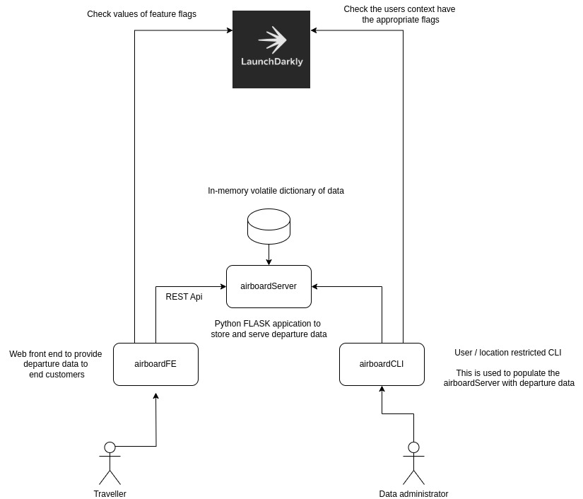

# Airboard project
The Airboard project is a full stack application to simulate the departure board for an airport.

There are three main components to this project
* airboardServer
* airboardFE
* airboardCLI

Below is a high level architecture of the platform.



## airboardServer
This is a Python Flask application that serves up flight data via REST API. It supports all CORS origins to keep it simple for now.

When the server starts, there is no data populated. For this we'll rely upon the airboardCLI project for this population.

## airboardFE
This is a simple HTML page that summarises departure information for end users. All of the data is pulled from the airboardServer container.

### Dynamically manage the version of the application
It has two versions, version 1.0, and verison 2.0. The version can be updated dynamically by creating, and setting the LaunchDarkly feature flag to ```enable_v2```.


### Dynamically switch the colour scheme from light to dark.
The colour scheme can be dynamically updated by creating and setting the ```dark_mode``` flag to true. This doesn't require a restart or reload of the application.


## airboardCLI
This is a simple python application which populates the database with departure data when run by an authorised user.

When run, it will attempt to automatically connect and populate the database.

There is a specific flag we check to see if we can write to the server


In our case, we have configured it using taregting rules to ensure that only automorised users, in authorised locations can update the database.


## Setup & Installation
### prerequisites
All three components of this application are containerised. They will work with either Docker or Podman.

### Clone the repository
Clone the repository 
```shell
$ git clone https://github.com/my0373/airboard.git
```
Switch into the git repository
```shell
$ cd airboard
```

### Create the Docker / Podman network
 For this reason, we will need to create a docker / podman network for the application to communicate in.

 From the command line of your mac / Linux system.

 ```shell
 $ docker network create ldnet 
 ```

You can verify the network was created correctly 
```shell
$ docker network ls | grep ldnet

   16b2c1977a48  ldnet                        bridge
```
## Building airboardServer
Switch into the airboardServer subdirectory

```
$ cd airboardServer
```

Build the container image
```
$ docker build -t airboardserver .
```
### Environment variables
```
# The SDK key for your deployment.
SDK_KEY=
```

Run the container image

SDK_KEY is your Launch Darkly sdk key. __NOTE: This isn't currently implemented for airboardServer.__
```
$ docker run --replace --name airboardserver --network=ldnet -d -p 8080:8080 -e SDK_KEY=your_sdk_key airboardserver
```

You can now test the server is running by attempting to connect to http://127.0.0.1:8080/flights/

```shell
$ curl 127.0.0.1:8080/flights/
{
  "1": {
    "airline_name": "Delta",
    "airport_ICAO": "JFK",
    "baggage_carousel": 1,
    "cancelled": false,
    "delayed": false,
    "expected_arrival_time": "2021-01-01T00:00:00",
    "expected_departure_time": "2021-01-01T00:00:00",
    "gate": "A1",
    "gate_changed": false
  }
}
```

Your server is now running correctly.
## Building airboardFE
Switch into the airboardFE subdirectory

```
$ cd airboardFE
```

Build the container image
```
$ docker build -t airboardfe .
```

Run the container image
```
docker run -d -p 8082:80 --name airboardfe --network=ldnet airboardfe
```

Test by connecting to the site
http://127.0.0.1:8082

You should see a single single row with an airline in it.

This proves connectivity between the front end and the server.

## Building airboardCLI
Switch into the airboardCLI subdirectory

### Environment variables
```
# The SDK key for your deployment.
LAUNCHDARKLY_SDK_KEY=

# This is an appication user to determine permissions.
LD_USER=

# This is an application setting to determine permissions.
LD_LOCATION=

# A debug variable for the platform.
LD_DEBUG=
```

Switch into the ```airboardCLI``` subdirectory
```
$ cd airboardCLI
```

Build the docker container
```
$ docker build -t airboardcli .
```

Run the docker container
```shell
$ docker run --rm -i --name=airboardcli --network=ldnet \
                                        -e LAUNCHDARKLY_SDK_KEY=your_sdk_key \
                                        -e LD_USER=your_launchdarkly_user \
                                        -e LD_LOCATION=your_location \
                                        -e LD_DEBUG=false \
                                        airboardcli
```